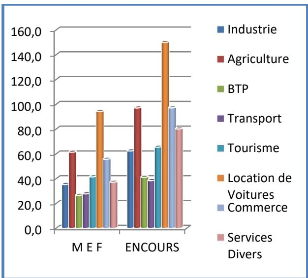
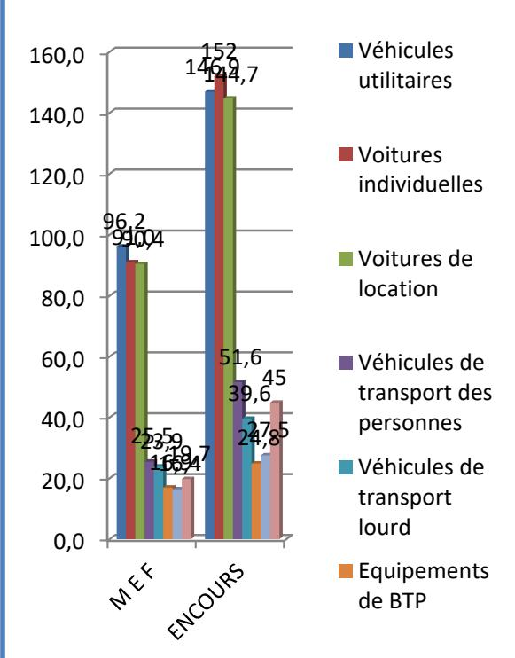

## Rapport Annuel 2025

C1L Leasing

Compagnie Internationale de Leasing

SOMMAIRE
<table><tr><td rowspan=1 colspan=4>1- ACTIVITÉ ET RÉSULTAT</td><td rowspan=1 colspan=1>3</td></tr><tr><td rowspan=1 colspan=4>A- PRÉSENTATION DE LA SOCIÉTÉ</td><td rowspan=1 colspan=1>3</td></tr><tr><td rowspan=1 colspan=4>B- LE SECTEUR DE LEASING EN TUNISIE</td><td rowspan=1 colspan=1>3</td></tr><tr><td rowspan=1 colspan=4>C- LA PRODUCTION DE LA CIL</td><td rowspan=1 colspan=1>4</td></tr><tr><td rowspan=1 colspan=4>D- LA CLASSIFICATION DES ENGAGEMENTS</td><td rowspan=3 colspan=1>556</td></tr><tr><td rowspan=1 colspan=1>E- LE REFINANCEMENT</td><td rowspan=2 colspan=3></td></tr><tr><td rowspan=1 colspan=1>F- LES RÉSULTATS</td></tr><tr><td rowspan=1 colspan=1>G- L’ÉVOLUTION DE LA SOCIÉTÉ ET DE SES PERFORMANCES AU COURS DES 5DERNIÈRES ANNÉES</td><td rowspan=1 colspan=3></td><td rowspan=1 colspan=1>7</td></tr><tr><td rowspan=1 colspan=1>H- LES ÉVÉNEMENTS IMPORTANTS SURVENUS ENTRE LA DATE DE CLÔTUREDE L’EXERCICE ET LA DATE À LAQUELLE LE RAPPORT A ÉTÉ ÉTABLI</td><td rowspan=1 colspan=3></td><td rowspan=1 colspan=1>8</td></tr><tr><td rowspan=1 colspan=1>1- PRÉVISIONS D’ACTIVITÉ ET PERFORMANCE DE LA SOCIÉTÉ DURANT LESTROIS ANS À VENIR</td><td rowspan=1 colspan=3></td><td rowspan=1 colspan=1>8</td></tr><tr><td rowspan=3 colspan=1>J- ETAT DE RÉALISATION DES PRÉVISIONS ANNONCÉES</td><td rowspan=3 colspan=2></td><td></td><td></td></tr><tr><td rowspan=2 colspan=2></td><td></td></tr><tr><td rowspan=1 colspan=1>9</td></tr><tr><td rowspan=1 colspan=1>K- L’ACTIVITÉ EN MATIÈRE DE RECHERCHE ET DÉVELOPPEMENT</td><td rowspan=1 colspan=2></td><td></td><td rowspan=1 colspan=1></td></tr><tr><td rowspan=1 colspan=1>L- CHANGEMENT DE MÉTHODE DE PRÉSENTATION</td><td rowspan=1 colspan=2></td><td></td><td rowspan=1 colspan=1>10</td></tr><tr><td rowspan=1 colspan=1>2- PARTICIPATION</td><td rowspan=1 colspan=3></td><td rowspan=1 colspan=1>10</td></tr><tr><td rowspan=1 colspan=1>A- L’ACTIVITÉ DES SOCIÉTÉS DONT LA SOCIÉTÉ ASSURE LE CONTRÔLE</td><td rowspan=1 colspan=3></td><td rowspan=1 colspan=1></td></tr><tr><td rowspan=1 colspan=1>B- LA PRISE DE PARTICIPATION ET LES ALIÉNATIONS</td><td rowspan=1 colspan=3></td><td rowspan=1 colspan=1></td></tr><tr><td rowspan=1 colspan=1>3- ACTIONNARIAT</td><td rowspan=1 colspan=3></td><td rowspan=1 colspan=1>10</td></tr><tr><td rowspan=1 colspan=1>4- OPÉRATION DE RACHAT DES ACTIONS PROPRES</td><td rowspan=1 colspan=3></td><td rowspan=1 colspan=1>11</td></tr><tr><td rowspan=1 colspan=1>5-  ORGANES D’ADMINISTRATION ET DE DIRECTION</td><td rowspan=1 colspan=3></td><td rowspan=1 colspan=1>12</td></tr><tr><td rowspan=1 colspan=1>6- LE TITRE EN BOURSE</td><td rowspan=1 colspan=3></td><td rowspan=1 colspan=1>15</td></tr><tr><td rowspan=1 colspan=1>7-  L’AFFECTATION DES RÉSULTATS</td><td rowspan=1 colspan=3></td><td rowspan=1 colspan=1>15</td></tr><tr><td rowspan=1 colspan=1>8- TABLEAU D’ÉVOLUTION DES CAPITAUX PROPRES</td><td rowspan=1 colspan=3></td><td rowspan=1 colspan=1></td></tr><tr><td rowspan=1 colspan=1>9- CONTRÔLE DES COMPTES</td><td rowspan=1 colspan=3></td><td rowspan=1 colspan=1>17</td></tr><tr><td rowspan=1 colspan=1>10- GESTION DES RESSOURCES HUMAINES</td><td rowspan=1 colspan=3></td><td rowspan=1 colspan=1>17</td></tr><tr><td rowspan=1 colspan=1>A- LES RESSOURCES HUMAINES</td><td rowspan=1 colspan=3></td><td rowspan=1 colspan=1>17</td></tr><tr><td rowspan=1 colspan=1>B- LA POLITIQUE SOCIALE</td><td rowspan=1 colspan=3></td><td rowspan=1 colspan=1></td></tr><tr><td rowspan=1 colspan=1>11- LE CONTRÔLE INTERNE</td><td rowspan=1 colspan=3></td><td rowspan=1 colspan=1>18</td></tr></table>

## 1- ACTIVITÉ ET RÉSULTAT

## A- PRESENTATION DE LA SOCIÉTÉ

Dénomination : Compagnie Internationale de Leasing

Forme Juridique : Société Anonyme

Nationalité : Tunisienne

Capital Social : 35.000.000 dinars divisé en 7.000.000 actions de 5 dinars de nominal

Siège Social : 16, Avenue Jean Jaurès – 1001 – Tunis

Téléphone : 71 33 66 55

Fax : 71 33 70 09

E-Mail : DG@cil.fin.tn

Identifiant Unique : 381878S

La société a pour objet principal d’effectuer des opérations de leasing portant sur des biens à usage industriel ou professionnel.

L'’activité de la société est régie par la loi n° 2016-48 du 11 juillet 2016 relative aux banques et aux établissements financiers, ainsi que la loi n° 94-89 du 26 juillet 1994 relative au leasing, telle qu'elle a été modifiée et complétée par la loi n° 2006-85 du 25 décembre 2006.

## B- LE SECTEUR DE LEASING EN TUNISIE

Le secteur du leasing a poursuivi sa dynamique de croissance en 2025. En effet, les nouvelles mises en force ont enregistré une progression de 6,2 %, passant de 2 162,6 MD en 2024 à 2 386,4 MD en 2024, puis à 2 533,9 MD en 2025.

Dans ce contexte, la CIL occupe la troisième position en termes de nouvelles mises en force, avec une part de marché de 15 %, stable par rapport à 2024.

L’encours financier des sociétés de leasing a également connu une hausse de 7,7 %, pour atteindre 4 464,6 MD à fin 2025, contre 4 145,4 MD à fin 2024 et 3 785 MD à fin 2024.

Dans ce cadre, la CIL se positionne également à la troisième place en termes d’encours financier, avec une part de marché de 14,2 %, stable par rapport à 2024.

## C- LA PRODUCTION DE LA CIL

Les mises en force ont atteint 379,9 MD au cours de l’année 2025 contre 375,1 MD au cours de l’année 2024, soit une augmentation de 4,8 MD (1,3%).

L'encours financier est passé de 598,4 MD à fin 2024 à 632,2 MD à fin 2025, soit une augmentation de 33,7 MD (5,6%).

La répartition des mises en force et de l’encours par secteur est la suivante :

<table><tr><td rowspan=1 colspan=1>Secteurs</td><td rowspan=1 colspan=1>MEF</td><td rowspan=1 colspan=1>ENCOURS</td></tr><tr><td rowspan=1 colspan=1>Industrie</td><td rowspan=1 colspan=1>35,4</td><td rowspan=1 colspan=1>62,5</td></tr><tr><td rowspan=1 colspan=1>Agriculture</td><td rowspan=1 colspan=1>61,4</td><td rowspan=1 colspan=1>97,1</td></tr><tr><td rowspan=1 colspan=1>BTP</td><td rowspan=1 colspan=1>26,6</td><td rowspan=1 colspan=1>41,2</td></tr><tr><td rowspan=1 colspan=1>Transport</td><td rowspan=1 colspan=1>27,8</td><td rowspan=1 colspan=1>38,5</td></tr><tr><td rowspan=1 colspan=1>Tourisme</td><td rowspan=1 colspan=1>41,5</td><td rowspan=1 colspan=1>65,5</td></tr><tr><td rowspan=1 colspan=1>Location de Voitures</td><td rowspan=1 colspan=1>94,2</td><td rowspan=1 colspan=1>150,0</td></tr><tr><td rowspan=1 colspan=1>Commerce</td><td rowspan=1 colspan=1>55,7</td><td rowspan=1 colspan=1>97,2</td></tr><tr><td rowspan=1 colspan=1>Services Divers</td><td rowspan=1 colspan=1>37,2</td><td rowspan=1 colspan=1>80,2</td></tr><tr><td rowspan=1 colspan=1>TOTAL</td><td rowspan=1 colspan=1>379,9</td><td rowspan=1 colspan=1>632,2</td></tr></table>

La répartition par type de matériel est la suivante :

<table><tr><td rowspan=1 colspan=1>Type d&#x27;immobilisation</td><td rowspan=1 colspan=1>M E F</td><td rowspan=1 colspan=1>ENCOURS</td></tr><tr><td rowspan=1 colspan=1>Véhicules utilitaires</td><td rowspan=1 colspan=1>96,2</td><td rowspan=1 colspan=1>146,9</td></tr><tr><td rowspan=1 colspan=1>Voitures individuelles</td><td rowspan=1 colspan=1>91,0</td><td rowspan=1 colspan=1>152</td></tr><tr><td rowspan=1 colspan=1>Voitures de location</td><td rowspan=1 colspan=1>90,4</td><td rowspan=1 colspan=1>144,7</td></tr><tr><td rowspan=1 colspan=1>Véhicules de transportdes personnes</td><td rowspan=1 colspan=1>25,5</td><td rowspan=1 colspan=1>51,6</td></tr><tr><td rowspan=1 colspan=1>Véhicules de transportlourd</td><td rowspan=1 colspan=1>23,9</td><td rowspan=1 colspan=1>39,6</td></tr><tr><td rowspan=1 colspan=1>Équipements de BTP</td><td rowspan=1 colspan=1>16,9</td><td rowspan=1 colspan=1>24,8</td></tr><tr><td rowspan=1 colspan=1>Autres Équipements</td><td rowspan=1 colspan=1>16,4</td><td rowspan=1 colspan=1>27,5</td></tr><tr><td rowspan=1 colspan=1>Immobiliers</td><td rowspan=1 colspan=1>19,7</td><td rowspan=1 colspan=1>45</td></tr><tr><td rowspan=1 colspan=1>TOTAL</td><td rowspan=1 colspan=1>379,9</td><td rowspan=1 colspan=1>632,2</td></tr></table>

## D- LA CLASSIFICATION DES ENGAGEMENTS

Au 31/12/2025, les engagements de la CIL auprès de la clientèle de leasing se présentent comme suit (en milliers de dinars) :

<table><tr><td colspan="2">Encours</td><td rowspan="2">Contrat en instance de MEF</td><td rowspan="2">Impayés</td><td rowspan="2">Avances reçues</td><td rowspan="2">TOTAL</td></tr><tr><td></td><td>financiers</td></tr><tr><td>Créances courantes</td><td>613 844</td><td>600</td><td>16 619</td><td>-6 194</td><td>624 869</td></tr><tr><td>Créances classées</td><td>22 540</td><td>0</td><td>35 890</td><td>-320</td><td>58 110</td></tr><tr><td>Engagements hors bilan</td><td>28 402</td><td>0</td><td>0</td><td>0</td><td>28 402</td></tr><tr><td>TOTAL</td><td>664 787</td><td>600</td><td>52 509</td><td>-6 514</td><td>711 382</td></tr></table>

Le total des engagements de la CIL (sans engagements hors bilan) est passé de 649,889 MD au 31/12/2024 à 682 980 MD au 31/12/2025, soit une augmentation de 5%.

Les créances classées ont augmenté de 3% passant de 56,386 MD en 2024 à 58,110 MD en 2025.

Les créances radiées s’élèvent au 31/12/2025 à 4,885 MD contre un montant de 2,239 au 31/12/2024.

Le ratio des créances accrochées par rapport au total des engagements est passé de 8,35% à fin 2024 à 8,17% à fin 2025.

Le ratio de couverture des créances accrochées par les provisions est passé de 63,27% à fin 2024 à 61,01% à fin 2025.

Une dotation aux provisions collectives supplémentaire de 0,605 MD a été constatée au cours de l’exercice 2025 pour atteindre un montant de 9,984 MD et ce conformément à la nouvelle méthode de calcul prévue au niveau de la circulaire BCT 2025-01 du 29/01/2025.

## E- LE REFINANCEMENT

Pour couvrir ses besoins en ressources, la CIL a cherché à optimiser le coût de ses ressources en recourant essentiellement aux crédits auprès des banques locales.

Au 31/12/2025, les emprunts et dettes rattachées se présentent comme suit (en milliers de dinars) :

<table><tr><td rowspan=1 colspan=1></td><td rowspan=1 colspan=1>2024</td><td rowspan=1 colspan=1>Remb.</td><td rowspan=1 colspan=1>Utilisat.</td><td rowspan=1 colspan=1>2025</td><td rowspan=1 colspan=1>Evolution</td></tr><tr><td rowspan=1 colspan=1>Emprunts Obligataires</td><td rowspan=1 colspan=1>25 500</td><td rowspan=1 colspan=1>-7 500</td><td rowspan=1 colspan=1>0</td><td rowspan=1 colspan=1>18 000</td><td rowspan=1 colspan=1>-7 500</td></tr><tr><td rowspan=1 colspan=1>Emprunts Etrangers</td><td rowspan=1 colspan=1>78 678</td><td rowspan=1 colspan=1>-25 697</td><td rowspan=1 colspan=1>0</td><td rowspan=1 colspan=1>52 980</td><td rowspan=1 colspan=1>-25 697</td></tr><tr><td rowspan=1 colspan=1>Emprunts locaux (MT)</td><td rowspan=1 colspan=1>325 878</td><td rowspan=1 colspan=1>-104 428</td><td rowspan=1 colspan=1>165 000</td><td rowspan=1 colspan=1>386 450</td><td rowspan=1 colspan=1>60 572</td></tr><tr><td rowspan=1 colspan=1>Certificats de Leasing</td><td rowspan=1 colspan=1>58 333</td><td rowspan=1 colspan=1>-83 333</td><td rowspan=1 colspan=1>50 000</td><td rowspan=1 colspan=1>25 000</td><td rowspan=1 colspan=1>-33 333</td></tr><tr><td rowspan=1 colspan=1>Total des emprunts à moyen terme</td><td rowspan=1 colspan=1>488 388</td><td rowspan=1 colspan=1>-220 958</td><td rowspan=1 colspan=1>215 000</td><td rowspan=1 colspan=1>482 430</td><td rowspan=1 colspan=1>-5 958</td></tr><tr><td rowspan=1 colspan=1>Certificats de Dépôt</td><td rowspan=1 colspan=1>6 500</td><td rowspan=1 colspan=1>-175 000</td><td rowspan=1 colspan=1>199 000</td><td rowspan=1 colspan=1>30 500</td><td rowspan=1 colspan=1>24 000</td></tr><tr><td rowspan=1 colspan=1>Total des emprunts à court terme</td><td rowspan=1 colspan=1>6 500</td><td rowspan=1 colspan=1>-175 000</td><td rowspan=1 colspan=1>199 000</td><td rowspan=1 colspan=1>30 500</td><td rowspan=1 colspan=1>24 000</td></tr><tr><td rowspan=1 colspan=1>Total des emprunts</td><td rowspan=1 colspan=1>494 888</td><td rowspan=1 colspan=1>-395 958</td><td rowspan=1 colspan=1>414 000</td><td rowspan=1 colspan=1>512 930</td><td rowspan=1 colspan=1>18 042</td></tr><tr><td rowspan=1 colspan=1>Dettes rattachées</td><td rowspan=1 colspan=1>9 935</td><td rowspan=1 colspan=1>-9 935</td><td rowspan=1 colspan=1>10 027</td><td rowspan=1 colspan=1>10 027</td><td rowspan=1 colspan=1>92</td></tr><tr><td rowspan=1 colspan=1>Emprunts et dettes rattachés</td><td rowspan=1 colspan=1>504 823</td><td rowspan=1 colspan=1></td><td rowspan=1 colspan=1></td><td rowspan=1 colspan=1>522 958</td><td rowspan=1 colspan=1>18 134</td></tr></table>

## F- LES RÉSULTATS

Les intérêts et produits assimilés de leasing (avant variation des produits réservés) sont passés de 86,470 MD en 2024 à 92,156 MD en 2025, soit une évolution de 5,686 MD (6,6%). Ils se répartissent comme suit :

<table><tr><td rowspan=1 colspan=4>2025            2024</td></tr><tr><td rowspan=6 colspan=1>Intérêts et produits de leasingIntérêts de retardAutres produits de leasingTotalVariation des produits réservésTotal des intérêts et produits de leasing</td><td rowspan=1 colspan=1>87 173</td><td rowspan=1 colspan=1>81 640</td><td rowspan=1 colspan=1></td></tr><tr><td rowspan=1 colspan=1>2731</td><td rowspan=1 colspan=1>2651</td><td rowspan=1 colspan=1></td></tr><tr><td rowspan=1 colspan=1>2252</td><td rowspan=1 colspan=1>2179</td><td rowspan=1 colspan=1></td></tr><tr><td rowspan=1 colspan=1>92 156</td><td rowspan=1 colspan=1>86 470</td><td rowspan=1 colspan=1></td></tr><tr><td rowspan=1 colspan=1>-1 189</td><td rowspan=1 colspan=1>-1 800</td><td rowspan=1 colspan=1></td></tr><tr><td rowspan=1 colspan=1>90 968</td><td rowspan=1 colspan=2>84 671</td></tr></table>

Les intérêts et charges assimilées supportés au titre des ressources de financement sont passés de 47,351 MD en 2024 à 48,094 MD en 2025, soit une augmentation de 0,743 MD (1,6%).

Le produit net est passé de 45,013 MD en 2024 à 49,310 MD en 2025, soit une augmentation de 4,297 MD (9,5%). Il se détaille comme suit :

<table><tr><td>(en milliers de dinars)</td><td>2025</td><td>2024</td></tr><tr><td rowspan="3">Intérêts et produits de leasing (avant var° des agios) Intérêts &amp; charges assimilés</td><td>92 156</td><td>86 470</td></tr><tr><td>-48 094</td><td>-47 351 7 532</td></tr><tr><td colspan="2">6 265</td></tr><tr><td rowspan="4">Autres Produits</td><td>170</td><td>161</td></tr><tr><td>PRODUIT NET</td><td>50 499 46 813</td></tr><tr><td>Variation des produits réservés</td><td>-1 189 -1 800</td></tr><tr><td>PRODUIT NET (après produits réservés) 49 310</td><td>45 013</td></tr></table>

Les charges d’exploitation sont passées de 13,537 MD au cours de l’année 2024 à 15,270 MD au cours de l’année 2025, soit une augmentation de 1,734 MD (13 %). Cette évolution s’explique principalement par la hausse des charges de personnel (+14 %), consécutive à l’application de la loi n° 9-2025 du 21 mai 2025 relative aux contrats de travail, ainsi qu'à l’augmentation corrélative des effectifs. Elle s’explique également par la progression des honoraires de gestion, liée à l’accroissement des montants placés dans les fonds gérés par CIL SICAR, dans le cadre de l’optimisation fiscale visant à bénéficier d’un dégrèvement financier.

Le coefficient d’exploitation (charges d’exploitation / produit net après agios réservés) a enregistré une légère hausse, passant de 30,1 % à fin 2024 à 31 % à fin 2025.

<table><tr><td>(en milliers de dinars)</td><td>2025</td><td>2024</td></tr><tr><td>Charges du personnel</td><td>10 063</td><td>8 816</td></tr><tr><td>Amortissements</td><td>691</td><td>535</td></tr><tr><td>Autres charges d&#x27;exploitation</td><td>4 517</td><td>4 186</td></tr><tr><td>Total</td><td>15 270</td><td>13 537</td></tr></table>

Les dotations nettes aux provisions liées à la clientèle sont passées de 2,844 MD en 2024 à 3,671 MD en 2025. Le détail de cette rubrique se présente comme suit :

<table><tr><td colspan="2">2025</td></tr><tr><td rowspan="2">Dotations aux provisions pour risques sur la clientèle Reprises de provisions</td><td>2024 7 894 5 977</td></tr><tr><td>-4 418 -3 258</td></tr><tr><td rowspan="2">Dotation aux provisions individuelles</td><td>3 476 2 719</td></tr><tr><td></td></tr><tr><td rowspan="2">Dotation (Reprises) aux provisions collectives</td><td>605 530</td></tr><tr><td></td></tr><tr><td rowspan="2">Encaissement sur créances radiées</td><td>-410 -405</td></tr><tr><td></td></tr><tr><td>Dotations nettes aux provisions</td><td>3 671 2 844</td></tr></table>

Le coût du risque global (Dotations aux provisions & Agios réservés) est passé de 4,644 MD à fin 2024 à 4,859 MD à fin 2025, soit une augmentation de 0,216 MD.

Les autres provisions sont passés de 0,725 MD à fin 2024 à 1,337 MD à fin 2025 et concerne essentiellement les provisions pour divers risques.

Les autres gains ordinaires sont passés de 0,293 MD à fin 2024 à 1,454 MD à fin 2025. Cette évolution s’explique principalement par les plus-values réalisées sur la cession des immeubles hors exploitation de la CIL pour un montant de 0,788 MD, les plus-values issues de la cession de certaines voitures pour 0,192 MD, ainsi que les autres gains résultant de l’apurement des comptes clients et des prestataires d’assurances pour 0,474 MD.

Le résultat net avant impôt est passé de 28,200 MD au cours de l’année 2024 à 30,485 MD au cours de l’année 2025, soit une augmentation de 8,1%.

Le résultat net est passé de 19,863 MD au cours de l’année 2024 à 21,384 MD au cours de l’année 2025, soit une augmentation de 7,7%.

## G- L’ÉVOLUTION DE LA SOCIÉTÉ ET DE SES PERFORMANCES AU COURS DES 5 DERNIÈRES ANNÉES

Les principaux indicateurs de performance de la société se résument comme suit :

<table><tr><td></td><td>2021</td><td>2022</td><td>2023</td><td>2024</td><td>2025</td></tr><tr><td>Les mises en forces</td><td>274</td><td>324,6</td><td>354,9</td><td>375,1</td><td>379,9</td></tr><tr><td>Encours sur la clientèle</td><td>490,3</td><td>514,1</td><td>554,8</td><td>598,4</td><td>632,2</td></tr><tr><td>Les revenus de leasing</td><td>68,5</td><td>76,5</td><td>80,8</td><td>86,5</td><td>92,2</td></tr><tr><td>Les créances accrochées</td><td>36</td><td>49,9</td><td>45,9</td><td>56,4</td><td>58,1</td></tr><tr><td>Les provisions (individuelle &amp; collective) et les produits réservés</td><td>35,1</td><td>39,3</td><td>42,2</td><td>45,1</td><td>45,4</td></tr><tr><td>Ratio Créances Accrochées</td><td>6,5%</td><td>8,7%</td><td>7,3%</td><td>8,4%</td><td>8,2%</td></tr><tr><td>Ratio de couverture des créances</td><td>82,3%</td><td>62,4%</td><td>72,8%</td><td>63,3%</td><td>61,0%</td></tr><tr><td>Les fonds propres</td><td>109,2</td><td>117,4</td><td>126,6</td><td>133,4</td><td>141,4</td></tr><tr><td>Les résultats nets</td><td>15,2</td><td>17,5</td><td>19,4</td><td>19,9</td><td>21,4</td></tr><tr><td>Créances Accrochées – Total provisions (A)</td><td>0,9</td><td>10,6</td><td>3,7</td><td>11,3</td><td>12,7</td></tr><tr><td>Risque Net (A) / Fonds propres</td><td>0,8%</td><td>9,1%</td><td>2,9%</td><td>8,5%</td><td>9%</td></tr></table>

## H- LES ÉVÉNEMENTS IMPORTANTS SURVENUS ENTRE LA DATE DE CLÔTURE DE L’EXERCICE ET LA DATE À LAQUELLE LE RAPPORT A ÉTÉ ÉTABLI

Le présent rapport reflète tous les événements survenus entre la date de clôture de l’exercice et la date de son établissement. Par conséquent, il ne reflète pas les événements survenus postérieurs à cette date.

## I- PRÉVISION D’ACTIVITÉS ET PERFORMANCE DE LA SOCIÉTÉ DURANT LES TROIS ANS À VENIR

Au cours des prochaines années, la CIL vise à consolider sa part dans le marché de leasing en renforçant son équipe commerciale et en ouvrant de nouvelles agences.

Elle veillera, par ailleurs, au maintien de la qualité du portefeuille et à accentuer l’effort au niveau de l’activité de recouvrement afin de baisser le coût du risque sur la clientèle.

Enfin, elle continuera l’optimisation de son système d’information afin d’affiner davantage ses reportings.

L'évolution prévisible du résultat de la Compagnie durant les trois ans à venir se présente comme suit :

<table><tr><td rowspan=1 colspan=1></td><td rowspan=1 colspan=1>2025</td><td rowspan=1 colspan=1>2026 (*)</td><td rowspan=1 colspan=1>2027 (*)</td><td rowspan=1 colspan=1>2028 (*)</td></tr><tr><td rowspan=1 colspan=1>Intérêts et produits assimilés de leasing</td><td rowspan=1 colspan=1>90 968</td><td rowspan=1 colspan=1>95 515</td><td rowspan=1 colspan=1>98 926</td><td rowspan=1 colspan=1>101 615</td></tr><tr><td rowspan=1 colspan=1>Intérêts et charges assimilées</td><td rowspan=1 colspan=1>-48 094</td><td rowspan=1 colspan=1>-48 174</td><td rowspan=1 colspan=1>-49 540</td><td rowspan=1 colspan=1>-51 135</td></tr><tr><td rowspan=1 colspan=1>Produits des placements</td><td rowspan=1 colspan=1>6 265</td><td rowspan=1 colspan=1>6 000</td><td rowspan=1 colspan=1>6 200</td><td rowspan=1 colspan=1>6700</td></tr><tr><td rowspan=1 colspan=1>Autres produits d&#x27;exploitation</td><td rowspan=1 colspan=1>170</td><td rowspan=1 colspan=1>180</td><td rowspan=1 colspan=1>200</td><td rowspan=1 colspan=1>220</td></tr><tr><td rowspan=1 colspan=1>PRODUITS NETS</td><td rowspan=1 colspan=1>49 310</td><td rowspan=1 colspan=1>53 521</td><td rowspan=1 colspan=1>55 786</td><td rowspan=1 colspan=1>57 400</td></tr><tr><td rowspan=1 colspan=1>CHARGES D&#x27;EXPLOITATION</td><td rowspan=1 colspan=1></td><td rowspan=1 colspan=1></td><td rowspan=1 colspan=1></td><td rowspan=1 colspan=1></td></tr><tr><td rowspan=1 colspan=1>Charges de personnel</td><td rowspan=1 colspan=1>10 063</td><td rowspan=1 colspan=1>11 300</td><td rowspan=1 colspan=1>11 500</td><td rowspan=1 colspan=1>12 420</td></tr><tr><td rowspan=1 colspan=1>Dotations aux amortissements</td><td rowspan=1 colspan=1>691</td><td rowspan=1 colspan=1>700</td><td rowspan=1 colspan=1>705</td><td rowspan=1 colspan=1>710</td></tr><tr><td rowspan=1 colspan=1>Autres charges d&#x27;exploitation</td><td rowspan=1 colspan=1>4517</td><td rowspan=1 colspan=1>5 400</td><td rowspan=1 colspan=1>5 750</td><td rowspan=1 colspan=1>6210</td></tr><tr><td rowspan=1 colspan=1>Total des charges d&#x27;exploitation</td><td rowspan=1 colspan=1>15 270</td><td rowspan=1 colspan=1>17 400</td><td rowspan=1 colspan=1>17 955</td><td rowspan=1 colspan=1>19 340</td></tr><tr><td rowspan=1 colspan=1>RESULTAT D&#x27;EXPLOITATION AVANTPROVISIONS</td><td rowspan=1 colspan=1>34 039</td><td rowspan=1 colspan=1>36 121</td><td rowspan=1 colspan=1>37 831</td><td rowspan=1 colspan=1>38 060</td></tr><tr><td rowspan=1 colspan=1>Dotations nettes aux provisions</td><td rowspan=1 colspan=1>3 671</td><td rowspan=1 colspan=1>4 022</td><td rowspan=1 colspan=1>4206</td><td rowspan=1 colspan=1>4354</td></tr><tr><td rowspan=1 colspan=1>Dotations nettes aux autres provisions</td><td rowspan=1 colspan=1>1337</td><td rowspan=1 colspan=1>1500</td><td rowspan=1 colspan=1>999</td><td rowspan=1 colspan=1>821</td></tr><tr><td rowspan=1 colspan=1>RESULTAT D&#x27;EXPLOITATION</td><td rowspan=1 colspan=1>29 032</td><td rowspan=1 colspan=1>30 599</td><td rowspan=1 colspan=1>32 626</td><td rowspan=1 colspan=1>32 885</td></tr><tr><td rowspan=1 colspan=1>Autres gains ordinaires</td><td rowspan=1 colspan=1>1454</td><td rowspan=1 colspan=1>150</td><td rowspan=1 colspan=1>150</td><td rowspan=1 colspan=1>150</td></tr><tr><td rowspan=1 colspan=1>Autres pertes ordinaires</td><td rowspan=1 colspan=1>-1</td><td rowspan=1 colspan=1>-10</td><td rowspan=1 colspan=1>-10</td><td rowspan=1 colspan=1>-10</td></tr><tr><td rowspan=1 colspan=1>RESULTAT AVANT IMPÔT</td><td rowspan=1 colspan=1>30 485</td><td rowspan=1 colspan=1>30 739</td><td rowspan=1 colspan=1>32 766</td><td rowspan=1 colspan=1>33 025</td></tr><tr><td rowspan=1 colspan=1>Impôt sur les bénéfices</td><td rowspan=1 colspan=1>-7 585</td><td rowspan=1 colspan=1>-8 060</td><td rowspan=1 colspan=1>-8 441</td><td rowspan=1 colspan=1>-8 461</td></tr><tr><td rowspan=1 colspan=1>Contribution sociale de solidarité</td><td rowspan=1 colspan=1>-758</td><td rowspan=1 colspan=1>-806</td><td rowspan=1 colspan=1>-844</td><td rowspan=1 colspan=1>-846</td></tr><tr><td rowspan=1 colspan=1>Contribution Conjoncturelle</td><td rowspan=1 colspan=1>-758</td><td rowspan=1 colspan=1>-806</td><td rowspan=1 colspan=1>-844</td><td rowspan=1 colspan=1>-846</td></tr><tr><td rowspan=1 colspan=1>RESULTAT NET DE LA PERIODE</td><td rowspan=1 colspan=1>21 384</td><td rowspan=1 colspan=1>21 067</td><td rowspan=1 colspan=1>22 636</td><td rowspan=1 colspan=1>22 871</td></tr></table>

(\*) Chiffres prévisionnels

## J- ETAT DE RÉALISATION DES PRÉVISIONS ANNONCÉES

## L’état de réalisation des prévisions annoncées de l’exercice 2025 se présente comme suit :

<table><tr><td rowspan=1 colspan=1></td><td rowspan=1 colspan=1>2025 (R)</td><td rowspan=1 colspan=1>2025 (P)</td><td rowspan=1 colspan=1>Ecart</td><td rowspan=1 colspan=1>Commentaire</td></tr><tr><td rowspan=1 colspan=1>Intérêts et produits assimilés deleasing</td><td rowspan=1 colspan=1>90 968</td><td rowspan=1 colspan=1>91 613</td><td rowspan=1 colspan=1>-645</td><td rowspan=1 colspan=1>Le taux de sortie moyen alégèrement baissé en suivant labaisse du TMM</td></tr><tr><td rowspan=1 colspan=1>Intérêts et charges assimilées</td><td rowspan=1 colspan=1>-48 094</td><td rowspan=1 colspan=1>-48 641</td><td rowspan=1 colspan=1>547</td><td rowspan=1 colspan=1>Baisse du TMM en 2025</td></tr><tr><td rowspan=1 colspan=1>Produits des placements</td><td rowspan=1 colspan=1>6 265</td><td rowspan=1 colspan=1>5 500</td><td rowspan=1 colspan=1>765</td><td rowspan=1 colspan=1>Plus-value réalisée surcertificat de dépôt et sur lesfonds gérés</td></tr><tr><td rowspan=1 colspan=1>Autres produits d&#x27;exploitation</td><td rowspan=1 colspan=1>170</td><td rowspan=1 colspan=1>200</td><td rowspan=1 colspan=1>-30</td><td rowspan=1 colspan=1>Ecart non significatif</td></tr><tr><td rowspan=1 colspan=1>PRODUITS NETS</td><td rowspan=1 colspan=1>49 310</td><td rowspan=1 colspan=1>48 672</td><td rowspan=1 colspan=1>638</td><td rowspan=1 colspan=1></td></tr><tr><td rowspan=1 colspan=1>CHARGES D&#x27;EXPLOITATION</td><td rowspan=1 colspan=1></td><td rowspan=1 colspan=1></td><td rowspan=1 colspan=1></td><td rowspan=1 colspan=1></td></tr><tr><td rowspan=1 colspan=1>Charges de personnel</td><td rowspan=1 colspan=1>10 063</td><td rowspan=1 colspan=1>9 800</td><td rowspan=1 colspan=1>263</td><td rowspan=1 colspan=1>Augmentation consécutive enapplication de la loi n°9-2025</td></tr><tr><td rowspan=1 colspan=1>Dotations aux amortissements</td><td rowspan=1 colspan=1>691</td><td rowspan=1 colspan=1>600</td><td rowspan=1 colspan=1>91</td><td rowspan=1 colspan=1>Ecart non significatif</td></tr><tr><td rowspan=1 colspan=1>Autres charges d&#x27;exploitation</td><td rowspan=1 colspan=1>4 517</td><td rowspan=1 colspan=1>4 840</td><td rowspan=1 colspan=1>-323</td><td rowspan=1 colspan=1>Baisse des charges relatives àla sous-traitance</td></tr><tr><td rowspan=1 colspan=1>Total des charges d&#x27;exploitation</td><td rowspan=1 colspan=1>15 270</td><td rowspan=1 colspan=1>15 240</td><td rowspan=1 colspan=1>30</td><td rowspan=1 colspan=1></td></tr><tr><td rowspan=1 colspan=1>RESULTAT D&#x27;EXPLOITATIONAVANT PROVISIONS</td><td rowspan=1 colspan=1>34 039</td><td rowspan=1 colspan=1>33 432</td><td rowspan=1 colspan=1>607</td><td rowspan=1 colspan=1></td></tr><tr><td rowspan=1 colspan=1>Dotations nettes aux prov etrésultat des créances radiées</td><td rowspan=1 colspan=1>3 671</td><td rowspan=1 colspan=1>3234</td><td rowspan=1 colspan=1>437</td><td rowspan=1 colspan=1>Sous-estimation des dotationssur provisions collectives.</td></tr><tr><td rowspan=1 colspan=1>Dotations nettes aux autresprovisions</td><td rowspan=1 colspan=1>1337</td><td rowspan=1 colspan=1>931</td><td rowspan=1 colspan=1>406</td><td rowspan=1 colspan=1>Constitution des provisionspour divers risques</td></tr><tr><td rowspan=1 colspan=1>RESULTAT D&#x27;EXPLOITATION</td><td rowspan=1 colspan=1>29 032</td><td rowspan=1 colspan=1>29 267</td><td rowspan=1 colspan=1>-235</td><td rowspan=1 colspan=1></td></tr><tr><td rowspan=1 colspan=1>Autres gains ordinaires</td><td rowspan=1 colspan=1>1454</td><td rowspan=1 colspan=1>150</td><td rowspan=1 colspan=1>1 304</td><td rowspan=1 colspan=1>Plus-value sur cession decertains immeubles horsexploitation et apurement dedivers comptes</td></tr><tr><td rowspan=1 colspan=1>Autres pertes ordinaires</td><td rowspan=1 colspan=1>-1</td><td rowspan=1 colspan=1>-10</td><td rowspan=1 colspan=1>9</td><td rowspan=1 colspan=1>Ecart non significatif</td></tr><tr><td rowspan=1 colspan=1>RESULTAT AVANT IMPÔT</td><td rowspan=1 colspan=1>30 485</td><td rowspan=1 colspan=1>29 407</td><td rowspan=1 colspan=1>1 078</td><td rowspan=1 colspan=1></td></tr><tr><td rowspan=1 colspan=1>Impôt sur les bénéfices</td><td rowspan=1 colspan=1>-7 585</td><td rowspan=1 colspan=1>-7 585</td><td rowspan=1 colspan=1>0</td><td rowspan=3 colspan=1>Ecart non significatif</td></tr><tr><td rowspan=1 colspan=1>Contribution sociale de solidarité</td><td rowspan=1 colspan=1>-758</td><td rowspan=1 colspan=1>-867</td><td rowspan=1 colspan=1>108</td></tr><tr><td rowspan=1 colspan=1>Contribution Conjoncturelle</td><td rowspan=1 colspan=1>-758</td><td rowspan=1 colspan=1>-867</td><td rowspan=1 colspan=1>108</td></tr><tr><td rowspan=1 colspan=1>RESULTAT APRES IMPOT</td><td rowspan=1 colspan=1>21 384</td><td rowspan=1 colspan=1>20 089</td><td rowspan=1 colspan=1>1 186</td><td rowspan=1 colspan=1></td></tr></table>

2025 (R) : il s’agit des réalisations de l’exercice 2025 en (mDt) 2025 (P) : il s’agit des prévisions de l’exercice 2025 en (mDt)

## K- L’ACTIVITÉ EN MATIÈRE DE RECHERCHE ET DÉVELOPPEMENT

Il n’y a pas d’activité en matière de recherche et développement réalisée au cours de l’exercice 2025 d’une importance significative qu'on peut citer au niveau de ce rapport.

# L- CHANGEMENT DE MÉTHODE DE PRÉSENTATION

Au 31 décembre 2025, il n’y a pas eu de changement de méthode de présentation.

## 2- PARTICIPATION :

## A- L’ACTIVITÉ DES SOCIÉTÉS DONT LA SOCIÉTÉ ASSURE LE CONTRÔLE

Les participations significatives restent celles souscrites au capital de la Compagnie Générale d'Investissement, intermédiaire en bourse et au capital de la CIL SICAR, société d’investissement à capital risque. En effet, la CIL détient en 2025, respectivement, 99,96% et 99,99% de leurs capitaux.

## B- LA PRISE DE PARTICIPATION ET LES ALIÉNATIONS

Les participations significatives restent celles souscrites au capital de la Compagnie Générale d'Investissement, intermédiaire en bourse et au capital de la CIL SICAR, société d’investissement à capital risque. En effet, la CIL détient en 2025, respectivement, 99,96% et 99,99% de leurs capitaux.

Le portefeuille d’investissement net de la CIL (hors Dépôts et cautionnements versés) est passé de 49,606 MD au 31 décembre 2024 à 57,168 MD au 31 décembre 2025, soit une augmentation de 7,562 MD.

En effet, les acquisitions de participations, réalisées dans le cadre des dégrèvements fiscaux financiers, se sont élevées à 10,354 MD au cours de l’exercice 2025. Ces montants ont été investis avant juin 2025 dans un fonds géré par CIL-SICAR, afin de respecter les engagements liés au dégrèvement fiscal au titre de l’impôt sur les sociétés de l’exercice 2024.

Par ailleurs, les cessions de titres ainsi que les réductions des fonds gérés se sont élevées à 2,792 MD.

Les mouvements enregistrés durant la période sur le poste « Titres de participations » et sur les « valeurs immobilisées » sont indiqués ci-après :

<table><tr><td rowspan=1 colspan=1></td><td rowspan=1 colspan=4>Valeur Brute</td><td rowspan=1 colspan=4>Provision</td><td rowspan=2 colspan=1>ValeurNet</td></tr><tr><td rowspan=1 colspan=1></td><td rowspan=1 colspan=1>2024</td><td rowspan=1 colspan=1>Diminution</td><td rowspan=1 colspan=1>Addition</td><td rowspan=1 colspan=1>2025</td><td rowspan=1 colspan=1>2024</td><td rowspan=1 colspan=1>Dotation</td><td rowspan=1 colspan=1>Reprise</td><td rowspan=1 colspan=1>2025</td></tr><tr><td rowspan=1 colspan=1>Filiales et participations</td><td rowspan=1 colspan=1>2 803</td><td rowspan=1 colspan=1>-498</td><td rowspan=1 colspan=1>0</td><td rowspan=1 colspan=1>2305</td><td rowspan=1 colspan=1>0</td><td rowspan=1 colspan=1>0</td><td rowspan=1 colspan=1>0</td><td rowspan=1 colspan=1>0</td><td rowspan=1 colspan=1>2 305</td></tr><tr><td rowspan=1 colspan=1>Titres en portage</td><td rowspan=1 colspan=1>2 306</td><td rowspan=1 colspan=1>0</td><td rowspan=1 colspan=1>0</td><td rowspan=1 colspan=1>2 306</td><td rowspan=1 colspan=1>2 306</td><td rowspan=1 colspan=1>0</td><td rowspan=1 colspan=1>0</td><td rowspan=1 colspan=1>2 306</td><td rowspan=1 colspan=1>0</td></tr><tr><td rowspan=1 colspan=1>Fonds gérés</td><td rowspan=1 colspan=1>46 803</td><td rowspan=1 colspan=1>-2 295</td><td rowspan=1 colspan=1>10 354</td><td rowspan=1 colspan=1>54 862</td><td rowspan=1 colspan=1>0</td><td rowspan=1 colspan=1>0</td><td rowspan=1 colspan=1>0</td><td rowspan=1 colspan=1>0</td><td rowspan=1 colspan=1>54 862</td></tr><tr><td rowspan=1 colspan=1>Total Général</td><td rowspan=1 colspan=1>51 912</td><td rowspan=1 colspan=1>-2 792</td><td rowspan=1 colspan=1>10 354</td><td rowspan=1 colspan=1>59 474</td><td rowspan=1 colspan=1>2 306</td><td rowspan=1 colspan=1>0</td><td rowspan=1 colspan=1>0</td><td rowspan=1 colspan=1>2 306</td><td rowspan=1 colspan=1>57 168</td></tr></table>

## 3- ACTIONNARIAT :

Au 31 décembre 2025, le capital social de la Société est composé ainsi :

<table><tr><td>Nombre d&#x27;action</td><td>7 000 000</td></tr><tr><td>Nombre de droits de vote</td><td>6 814 927</td></tr></table>

Le nombre de droits de vote s’élève au 31 décembre 2025 à 6 814 927 droits vu que la société détient 184 922 actions propres et le nombre des droits d’attribution non convertis représente la contrepartie de 151 actions.

Tout actionnaire détenant 10 actions ou plus peut assister à l’assemblée générale de la société ou se faire représenter en vertu d’une procuration.

Les principaux actionnaires détenant plus de 5% du capital, à fin décembre 2025, se présentent comme suit :

<table><tr><td>Actionnaires</td><td>Nombre d&#x27;actions</td><td>% du capital</td><td>% des droits de vote</td></tr><tr><td>Société Générale Financière</td><td>2 847 923</td><td>40,68%</td><td>41,79%</td></tr><tr><td>TTS Financière</td><td>810 180</td><td>11,57%</td><td>11,89%</td></tr><tr><td>Tunisian Travel Service</td><td>637 396</td><td>9,11%</td><td>9,35%</td></tr><tr><td>BOUAZIZ Salma</td><td>361 236</td><td>5,16%</td><td>5,30%</td></tr><tr><td>BOUAZIZ Hend</td><td>360 744</td><td>5,15%</td><td>5,29%</td></tr></table>

## 4- CONDITION ET DÉROULEMENT DES OPÉRATIONS DE RACHAT ET REVENTE DES ACTIONS PROPRES

En application de l’article 19 de la loi 94-117 du 14 novembre 1994 tel que modifié par la loi 99-92 du 17 aout 1999, l’Assemblée Générale du 18 avril 2025 a autorisé expressément le Conseil d'Administration de la société à acheter et revendre ses propres actions en bourse en vue de régulariser leurs cours sur le marché.

Les conditions de rachat se présentent comme suit :

\- Durée de l’autorisation : 3 ans se terminant avec l’assemblée générale statuant sur l’exercice 2025.

\- Nombre maximum d’actions que la société peut obtenir : 10% du total des actions composant le capital en tenant compte des titres détenus actuellement par la société.

Par ailleurs, la société doit disposer, au moment de la décision de l'assemblée générale de réserves autres que les réserves légales, d'un montant au moins égal à la valeur de l'ensemble des actions à acquérir.

Les mouvements enregistrés sur cette rubrique se détaillent comme suit :

<table><tr><td rowspan=1 colspan=1></td><td rowspan=1 colspan=1>Nombre</td><td rowspan=1 colspan=1>Coût</td></tr><tr><td rowspan=1 colspan=1></td><td rowspan=1 colspan=1></td><td rowspan=1 colspan=1></td></tr><tr><td rowspan=1 colspan=1>Solde au 31 décembre 2024</td><td rowspan=1 colspan=1>250 603</td><td rowspan=1 colspan=1>2 721 695</td></tr><tr><td rowspan=1 colspan=1>Cession de l&#x27;exercice</td><td rowspan=1 colspan=1>-65 681</td><td rowspan=1 colspan=1>-713 334</td></tr><tr><td rowspan=1 colspan=1>Solde au 31 décembre 2025</td><td rowspan=1 colspan=1>184 922</td><td rowspan=1 colspan=1>2 008 361</td></tr></table>

Le rachat de la CIL de ses propres actions a eu pour effet la régularisation de son cours boursier.

Le rachat et la revente de la CIL de ses propres actions ont été fait en application de la résolution du Conseil d'administration du 07 Juillet 2020 qui prévoit l’achat si la valeur de l’action en bourse est inférieure à 10DT et la revente si la valeur de l'action est supérieure à 20 DT.

Le nombre des actions détenues par la CIL représente, au 31 décembre 2025, 2,71% des actions en circulation.

## 5- ORGANES D’ADMINISTRATION & DE DIRECTION

## A- RÈGLES APPLICABLES À LA NOMINATION ET AU REMPLACEMENT DES MEMBRES DU CONSEIL D’ADMINISTRATION

La société est administrée par un conseil d'administration composé de membres désignés par l'Assemblée Générale conformément à la loi et aux statuts.

La durée des fonctions d’administrateurs est de trois années renouvelables pour la même période. Tout membre est rééligible.

En cas de vacance d'un poste d’administrateur, suite à un décès, incapacité physique, une démission ou à la survenance d’une incapacité juridique, le Conseil peut, entre deux assemblées générales, procéder à des nominations à titre provisoire à charge de ratification par la prochaine assemblée générale. Lorsque le nombre des administrateurs devient inférieur au minimum légal, les autres membres doivent immédiatement convoquer l’assemblée générale ordinaire pour combler l’insuffisance.

## B- PRINCIPALES DÉLÉGATIONS EN COURS DE VALIDITÉ ACCORDÉES PAR L'ASSEMBLÉE GÉNÉRALE AUX ORGANES D'ADMINISTRATION ET DE DIRECTION

L'Assemblée Générale Ordinaire du 22 avril 2025 a autorisé l’émission par la société d’un ou plusieurs emprunts obligataires d’un montant de 150.000.000 D et ce, avant la date de la tenue de l’A.G.O. statuant sur l’exercice 2025 et a autorisé le Conseil d’administration pour en fixer les montants successifs, les modalités et les conditions l’émission.

## C- COMPOSITION ET RÔLE DES ORGANES D’ADMINISTRATION ET DE DIRECTION

La société est administrée par un conseil d’administration composé de membres désignés par l’Assemblée Générale conformément à la loi et aux statuts.

## CONSEIL D'ADMINISTRATION

President

\- Mr. Mohamed BRIGUI

## Membres

\- Mr. Raouf NEGRA, représentant de la société T.T.S.

\- Mme. Héla BRIGUI HAMIDA

\- Mme. Salma BOUAZIZ

\- Mr.Sofiène HAJ TAIEB

\- Mr. Kilani ZIADI, administrateur représentant les intérêts des actionnaires minoritaires

\- Mr. Eymen ERRAIS, administrateur indépendant

\- Mr. Kamel LOUHAICHI, administrateur indépendant

## DIRECTION GENERALE

La société est dirigée comme suit :

H Directeur Général

\- Mr. Salah SOUKI

## D- COMITÉS SPÉCIAUX ET RÔLE DE CHAQUE COMITÉ

## ① Comité d'audit

Président

\- Mr. Kamel LOUHAICHI

Membres

\- Mr. Raouf NEGRA

\- Mme. Héla BRIGUI HAMIDA

Ce comité veille à ce que les mécanismes appropriés de contrôle interne soient mis en place, assure le suivi des travaux de contrôle, etc.

## ② Comité des risques

Président

\- Mr. Eymen ERRAIS

Membres

\- Mme. Salma BOUAZIZ

\- Mr. Kilani ZIADI

Ce comité assure la surveillance de tous les risques auxquels la société est exposée ainsi que le suivi du respect de la réglementation et des politiques arrêtées en la matière.

## ③ Comité de Direction

## Membres

\- Le président du conseil d’administration ;

\- Le directeur général ;

\- Les directeurs régionaux ;

\- Le directeur de trésorerie ;

\- Le directeur administratif et comptable.

Ce comité examine, étudie et approuve les nouveaux dossiers de financements, suit les besoins de la société en refinancement, assure un suivi de l’activité et des plans de recouvrement, examine la situation financière et les performances de la société etc.

## E- LES FONCTIONS ET LES ACTIVITÉS PRINCIPALES EXERCÉES PAR LES ADMINISTRATEURS DANS D’AUTRES SOCIÉTÉS

<table><tr><td rowspan=1 colspan=1>Nom / Raison social</td><td rowspan=1 colspan=1>Fonction</td><td rowspan=1 colspan=1>Représentépar</td><td rowspan=1 colspan=1>Mandat</td><td rowspan=1 colspan=1>Adresse</td><td rowspan=1 colspan=1>Activité</td></tr><tr><td rowspan=1 colspan=1></td><td rowspan=1 colspan=1></td><td rowspan=1 colspan=1></td><td rowspan=1 colspan=1></td><td rowspan=1 colspan=1></td><td rowspan=1 colspan=1></td></tr><tr><td rowspan=1 colspan=1>M. Mohamed BRIGUI</td><td rowspan=1 colspan=1>Président duConseild’Administration</td><td rowspan=1 colspan=1>Lui-même</td><td rowspan=1 colspan=1>2023-2025</td><td rowspan=1 colspan=1>Tunis</td><td rowspan=1 colspan=1>PDG Société TouristiqueOCEANAPDG Société GénéraleFinancière</td></tr><tr><td rowspan=1 colspan=1>Tunisian Travel Service</td><td rowspan=1 colspan=1>Administrateur</td><td rowspan=1 colspan=1>M. RaoufNEGRA</td><td rowspan=1 colspan=1>2023-2025</td><td rowspan=1 colspan=1>Tunis</td><td rowspan=1 colspan=1>Directeur Administratif etComptable du groupe TTS</td></tr><tr><td rowspan=1 colspan=1>Mme. Héla BRIGUIHAMIDA</td><td rowspan=1 colspan=1>Administrateur</td><td rowspan=1 colspan=1>Lui-même</td><td rowspan=1 colspan=1>2023-2025</td><td rowspan=1 colspan=1>Tunis</td><td rowspan=1 colspan=1>PDG Société « CILIMMOBILIERE »PDG Société « CIL SICAR »</td></tr><tr><td rowspan=1 colspan=1>Mme. Salma BOUAZIZ</td><td rowspan=1 colspan=1>Administrateur</td><td rowspan=1 colspan=1>Lui-même</td><td rowspan=1 colspan=1>2025</td><td rowspan=1 colspan=1>Tunis</td><td rowspan=1 colspan=1>Directeur Financier de lasociété immobilière Ezzamni</td></tr><tr><td rowspan=1 colspan=1>M. Sofiène HAJ TAIEB</td><td rowspan=1 colspan=1>Administrateur</td><td rowspan=1 colspan=1>Lui-même</td><td rowspan=1 colspan=1>2023-2025</td><td rowspan=1 colspan=1>Tunis</td><td rowspan=1 colspan=1>Directeur général de lasociété « La FrançaiseInvestment Solutions »</td></tr><tr><td rowspan=1 colspan=1>M. Kilani ZIADI</td><td rowspan=1 colspan=1>Administrateurreprésentant desactionnairesminoritaires</td><td rowspan=1 colspan=1>Lui-même</td><td rowspan=1 colspan=1>2023-2025</td><td rowspan=1 colspan=1>Tunis</td><td rowspan=1 colspan=1>Retraité</td></tr><tr><td rowspan=1 colspan=1>M. Eymen ERRAIS</td><td rowspan=1 colspan=1>AdministrateurIndépendant</td><td rowspan=1 colspan=1>Lui-même</td><td rowspan=1 colspan=1>2023-2025</td><td rowspan=1 colspan=1>Tunis</td><td rowspan=1 colspan=1>Enseignant universitaireConsultant en RiskManagement auprès desbailleurs de fonds étrangers</td></tr><tr><td rowspan=1 colspan=1>Mr. KamelLOUHAICHI</td><td rowspan=1 colspan=1>AdministrateurIndépendant</td><td rowspan=1 colspan=1>Lui-même</td><td rowspan=1 colspan=1>2024-2025</td><td rowspan=1 colspan=1>Tunis</td><td rowspan=1 colspan=1>PDG Cap ValeurAdministrateur chez « DéliceHolding »</td></tr></table>

## F- LES PARTICIPATIONS DES ADMINISTRATEURS DANS D’AUTRES SOCIÉTÉS

<table><tr><td rowspan=1 colspan=1>Membres</td><td rowspan=1 colspan=1>Participation dans d’autres sociétés</td></tr><tr><td rowspan=1 colspan=1>M Mohamed BRIGUI</td><td rowspan=1 colspan=1>Société Générale FinancièreSociété Touristique OCEANASociété « CIL IMMOBILIERE »</td></tr><tr><td rowspan=1 colspan=1>Mme Salma BOUAZIZ</td><td rowspan=1 colspan=1>UIB</td></tr><tr><td rowspan=1 colspan=1>Mr Sofiene HAJ TAIEB</td><td rowspan=1 colspan=1>La Française Investment Solutions</td></tr><tr><td rowspan=1 colspan=1>Mme. Héla BRIGUI HAMIDA</td><td rowspan=1 colspan=1>Société Générale Financière</td></tr></table>

## 6- LE TITRE EN BOURSE

Lors de l'Assemblée Générale Extraordinaire du 18 avril 2023, il a été décidé d'augmenter le capital social de la société de dix millions (10 000 000D) de dinars, le portant à trente-cinq millions (35 000 000D) de dinars par incorporation de réserves et distribution de deux millions (2 000 000) d'actions gratuites (soit deux actions gratuites pour 5 actions anciennes), avec jouissance le 01/01/2023. Cette augmentation a conduit le nombre de titres en circulation à passer de 5 000 000 à 7 000 000 actions.

Le cours de clôture du titre CIL à la fin de décembre 2025 s'est établi à 28,25 DT contre un cours de 24,9 DT à la fin de décembre 2024. De plus, les quantités annuelles échangées sont passées de 207 621 titres pour une valeur de 4 253 mD au cours de l'année 2024 à 346 721 titres pour une valeur de 8 869 mD au cours de l'année 2025.

En ce qui concerne la capitalisation boursière, celle-ci a progressé de manière significative, passant de 86,25 MD à la fin de 2021, à 97,5 MD à la fin de 2022, à 134,33 MD à la fin de 2023, à 174,3 MD à la fin de 2024, pour finalement atteindre 197,750 MD à la fin de 2025.

## 7- L’AFFECTATION DES RÉSULTATS

Le bénéfice distribuable est constitué du résultat comptable net majoré ou minoré des résultats reportés des exercices antérieurs, et ce, après déduction de ce qui suit :

V Une fraction égale à 5% du bénéfice déterminé comme ci-dessus indiqué au titre de réserve légale. Ce prélèvement cesse d’être obligatoire lorsque cette réserve atteint le dixième du capital social.

La réserve prévue par les textes législatifs spéciaux dans la limite des taux qui y sont fixés ;

Y Toutes sommes que l’assemblée des actionnaires juge convenables pour la constitution de fonds de réserves.

Les bénéfices distribuables conformément aux statuts s’élèvent à 32 338 337 DT, déterminés comme suit :

<table><tr><td rowspan=1 colspan=1>Résultat net 2025                                                                                    21 383 652,473</td></tr><tr><td rowspan=1 colspan=1>Report à nouveau (distribuables en franchise de R/S) :                207 020,776</td></tr><tr><td rowspan=1 colspan=1>Total Report à nouveau (distribuables en franchise de R/S) :                                207 020,776</td></tr><tr><td rowspan=1 colspan=1>Report à nouveau (soumis à la R/S)                                        16 188 075,626</td></tr><tr><td rowspan=1 colspan=1>Réserves de réinvestissements devenues libres (soumis à laR/S)                                                                               2 294 716,400</td></tr><tr><td rowspan=1 colspan=1>Total Report à nouveau (soumis à la R/S)                                         18 482 792,026</td></tr><tr><td rowspan=1 colspan=1></td></tr><tr><td rowspan=1 colspan=1>Total                                                               40 073 465,275</td></tr><tr><td rowspan=1 colspan=1>Réserves pour Réinvestissements exonérés                                                     -11 377 200,000</td></tr><tr><td rowspan=1 colspan=1>Solde à affecter                                                         28 696 265,275</td></tr></table>

(R/S) : Retenue à la source en application des dispositions de l’article 19 de la loi de finances pour la gestion de 1’année 2014.

## 8- TABLEAU D’ÉVOLUTION DES CAPITAUX PROPRES AU COURS DES 3 DERNIERS EXERCICES

<table><tr><td></td><td>Capital social</td><td>Réserve légale</td><td>Réserve pour réinvestissement</td><td>Réserves pour fonds social</td><td>Résultats reportés</td><td>Actions propres</td><td>Compléments d&#x27;apport</td><td>Résultat de l&#x27;exercice</td><td>Total</td></tr><tr><td>Solde au 31 décembre 2022 Affectations approuvées par l&#x27;A.G.O. du 18 avril 2023</td><td>25 000 000</td><td>2 500 000</td><td>42 805 710 11 080 500</td><td>4 053 747 800 000</td><td>28 978 138 5 653 024</td><td>(3 495 588)</td><td>7 397</td><td>17 533 524 (17 533 524)</td><td>117 382 927 0</td></tr><tr><td>Affectations approuvées par l&#x27;A.G.O. du 18 avril 2023</td><td>10 000 000</td><td></td><td>(9 153 480)</td><td></td><td>9 153 480</td><td></td><td></td><td></td><td>0</td></tr><tr><td>Augmentation du capital décidée par l&#x27;AGE du 18/04 2023</td><td></td><td></td><td></td><td></td><td>(10 000 000) (11 000 000)</td><td></td><td></td><td></td><td>0</td></tr><tr><td>Dividendes versés sur le bénéfice de 2022</td><td></td><td></td><td></td><td></td><td></td><td></td><td></td><td></td><td>(11 000 000)</td></tr><tr><td>Encaissement dividendes sur actions propres</td><td></td><td></td><td></td><td></td><td>440 000</td><td></td><td></td><td></td><td>440 000</td></tr><tr><td>Cession d&#x27;actions propres</td><td></td><td></td><td></td><td></td><td></td><td>454 624</td><td>143 879</td><td></td><td>598 503</td></tr><tr><td>Prélèvements sur fonds social</td><td></td><td></td><td></td><td>(219 339)</td><td></td><td></td><td></td><td></td><td>(219 339)</td></tr><tr><td>Résultat net de l&#x27;exercice 2023</td><td></td><td></td><td></td><td></td><td></td><td></td><td></td><td>19 369 395</td><td>19 369 395</td></tr><tr><td>Solde au 31 décembre 2023</td><td>35 000 000</td><td>2 500 000</td><td>44 732 730</td><td>4 634 408</td><td>23 224 641</td><td>(3 040 964)</td><td>151 275</td><td>19 369 395</td><td>126 571 485</td></tr><tr><td>Affectations approuvées par l&#x27;A.G.O. du 16 avril 2024</td><td></td><td>1 000 000</td><td>9 802 000</td><td>900 000</td><td>7 667 395</td><td></td><td></td><td></td><td></td></tr><tr><td></td><td></td><td></td><td>(3 242 480)</td><td></td><td>3 242 480</td><td></td><td></td><td>(19 369 395)</td><td>0</td></tr><tr><td>Affectations approuvées par l&#x27;A.G.O. du 16 avril 2024</td><td></td><td></td><td></td><td></td><td>(14 000 000)</td><td></td><td></td><td></td><td>0 (14 000 000)</td></tr><tr><td>Dividendes versés sur le bénéfice de 2023 Encaissement dividendes sur actions propres</td><td></td><td></td><td></td><td></td><td>514 173</td><td></td><td></td><td></td><td>514 173</td></tr><tr><td>Cession d&#x27;actions propres</td><td></td><td></td><td></td><td></td><td></td><td>319 269</td><td>297 261</td><td></td><td>616 530</td></tr><tr><td>Prélèvements sur fonds social</td><td></td><td></td><td></td><td>(162 852)</td><td></td><td></td><td></td><td></td><td>(162 852)</td></tr><tr><td>Résultat net de l&#x27;exercice 2024</td><td></td><td></td><td></td><td></td><td></td><td></td><td></td><td>19 862 847</td><td>19 862 847</td></tr><tr><td>Solde au 31 décembre 2024</td><td>35 000 000</td><td>3 500 000</td><td>51 292 250</td><td>5 371 556</td><td>20 648 690</td><td>(2 721 695)</td><td>448 536</td><td></td><td>133 402 184</td></tr><tr><td>Affectations approuvées par l&#x27;A.G.O. du 22/04/2025</td><td></td><td></td><td>10 354 000</td><td>1 000 000</td><td>8 508 847</td><td></td><td></td><td>19 862 847</td><td></td></tr><tr><td>Affectations approuvées par l&#x27;A.G.O. du 22/04/2025</td><td></td><td></td><td>(2 180 800)</td><td></td><td>2 180 800</td><td></td><td></td><td>(19 862 847)</td><td>0</td></tr><tr><td>Dividendes versés sur le bénéfice de 2024</td><td></td><td></td><td></td><td></td><td>(15 400 000)</td><td></td><td></td><td></td><td>0</td></tr><tr><td></td><td></td><td></td><td></td><td></td><td></td><td>713 334</td><td>960 465</td><td></td><td>(15 400 000)</td></tr><tr><td>Cession d&#x27;actions propres</td><td></td><td></td><td></td><td></td><td>456 760</td><td></td><td></td><td></td><td>1 673 799</td></tr><tr><td>Encaissement dividendes sur actions propres</td><td></td><td></td><td></td><td>(128 258)</td><td></td><td></td><td></td><td></td><td>456 760</td></tr><tr><td>Prélèvements sur fonds social</td><td></td><td></td><td></td><td></td><td></td><td></td><td></td><td></td><td>(128 258)</td></tr><tr><td>Résultat net de l&#x27;exercice 2025</td><td></td><td></td><td></td><td></td><td></td><td></td><td></td><td>21 383 652</td><td>21 383 652</td></tr><tr><td>Solde au 31 décembre 2025</td><td>35 000 000</td><td>3 500 000</td><td>59 465 450</td><td>6 243 298</td><td>16 395 096</td><td>(2 008 361)</td><td>1 409 000</td><td>21 383 652</td><td>141 388 136</td></tr></table>

## 9- CONTRÔLE DES COMPTES

L'Assemblée Générale Ordinaire a désigné les deux commissaires aux comptes suivants, remplissant les conditions légales requises, qui ont mandat de vérifier, sous leur responsabilité, la régularité des états financiers de la société et leur sincérité conformément aux dispositions légales et réglementaires en vigueur :

Groupement de sociétés d'expertise comptables : Universal Auditing & « CNBA TUNISIA » membre du réseau international « UHY INTERNATIONAL » Résidence Raoudha - n°152 - Rue du Lac Windermere, Les Berges du Lac, 1053, Tunis, Tunisie

## PROAUDIT

Rue Abou Hamed El Ghazali – Immeuble les Chalets 2ème Etage, Apt. 21 Mont-Plaisir, 1073, Tunis, Tunisie

## 10- GESTION DES RESSOURCES HUMAINES

## A- LES RESSOURCES HUMAINES.

Le personnel de la CIL est composé de 121 personnes, réparti comme suit :

<table><tr><td></td><td>2024</td><td>Départ</td><td>Recrutement</td><td>2025</td></tr><tr><td>Cadres et encadrement</td><td>86</td><td>4</td><td>5</td><td>87</td></tr><tr><td>Agents d’exécution</td><td>8</td><td>0</td><td>1</td><td>9</td></tr><tr><td>Agents de service</td><td>4</td><td>0</td><td>21</td><td>25</td></tr><tr><td>TOTAL</td><td>98</td><td>4</td><td>27</td><td>121</td></tr></table>

L'effectif de la CIL s’établit à 121 employés à fin 2025, contre 98 à fin 2024, soit une augmentation de 23%. Cette évolution résulte principalement de l'intégration d'agents de services, conformément aux dispositions de la loi n° 2025-9 du 21 mai 2025 relative à la réglementation des contrats de travail et à l’interdiction de la sous-traitance de main-d’œuvre.

## B- LA POLITIQUE SOCIALE

Le volet social bénéficie d'un intérêt particulier de la part de la Direction Générale de la société, notamment à travers :

1- La mise en place d’un programme de formation de nature à améliorer les compétences des employés et leur polyvalence.

2- La motivation et la fidélisation de l’ensemble du personnel à travers la mise en place d’un Fonds Social alimenté par les bénéfices de la société et qui permet d’octroyer un ensemble de prêts et d’alimenter les fonds de l’amicale de la CIL, créée pour subventionner les œuvres sociales réalisées au profit du personnel.

3- L'encouragement des employés de la CIL à travers des mécanismes d’incitation par rapport aux objectifs de réalisation en termes de mises en force et de recouvrement.

# 11- LE CONTRÔLE INTERNE

La CIL a mis en place un ensemble de procédures de contrôle interne de nature à minimiser les différents risques auxquels elle est exposée.

L'objectif de la Compagnie est ainsi, de disposer en premier lieu d'un système de contrôle interne efficace permettant de réviser périodiquement les procédures appliquées et d’apprécier leur efficacité par rapport à l’évolution de l’activité en contrôlant leur bonne application. Ce système vise principalement les objectifs suivants :

S'assurer que les opérations réalisées par la Compagnie sont conformes aux dispositions législatives et réglementaires, et sont conduites de façon prudente et appropriée en accord avec la politique arrêtée par la Direction ;

Assurer la protection et la sauvegarde des actifs de la Compagnie contre les risques inhérents à l'organisation et à l'activité de leasing, notamment les risques liés aux irrégularités, erreurs et fraudes qui pourraient survenir ;

Garantir l'obtention d'une information financière complète, fiable, en accord avec les règles prévues, et dans les délais requis.

La CIL ayant un seul produit « le leasing » peut être exposée essentiellement à un risque de défaillance de la clientèle, appelé risque de crédit. Elle peut être exposée, aussi, à d’autres types de risques tels que le risque de taux, le risque de liquidité et le risque opérationnel. Pour ces raisons, tous les organes de gouvernance de la Compagnie veillent à garantir la compatibilité des risques pris, avec les objectifs de performance et de rentabilité, ainsi que les règles prudentielles. Ils veillent ainsi à :

S’assurer que tous les risques auxquels la Compagnie est confrontée sont bien identifiés et couverts ;

Identifier, recenser, quantifier et analyser les risques liés à l’activité de la Compagnie ;

Mesurer les résultats et les performances et définir la matrice risques-rentabilité.

Afin de remédier au risque de crédit, la préoccupation majeure des activités de l’audit interne est de contrôler les dossiers commerciaux et les procédures d’octroi des crédits. Il s’agit donc de contrôler et de revoir les pouvoirs, les responsabilités et les compétences des différents responsables autorisés et impliqués dans la gestion du risque de crédit (approbation, engagement, désengagement).Ce risque est contrôlé, aussi, à travers l’amélioration et la réactivité du recouvrement, l’assurance d’un bon recours au contentieux, le suivi des créances accrochées et l’adéquation de leurs couvertures par les provisions et les agios réservés.

Dans le cadre de l’amélioration du processus de décision d’octroi des crédits à la clientèle et pour une meilleure gestion du risque de contrepartie, la CIL a amélioré depuis 2017 son outil de Scoring en l’intégrant au niveau des habilitations et la définition des pouvoirs décisionnels. Cet outil servira, ainsi pour l’ensemble des parties prenantes de la CIL, comme étant un outil d’aide à la décision relative à l’octroi de crédit et permettra à la CIL l’optimisation de l’efficacité de prise de décision, l’automatisation des études des dossiers de crédit et l’accélération du processus d’octroi des crédits à la clientèle.

La CIL est, en outre, exposée au risque de taux du fait qu’une partie de ses emprunts sont à taux variable, alors que ses emplois sont pour leur majorité à taux fixe. Dans ce cadre, la CIL a prévu au niveau de ses nouveaux contrats de leasing des clauses permettant de réviser le montant des intérêts facturés au client en fonction du changement du TMM, afin de limiter les risques d’une variation importante du TMM.

Par ailleurs, la compagnie gère ce type de risque corrélativement avec le risque de liquidité mentionné ci-dessous tout en maintenant une politique prudente en terme d’octroi des crédits avec la consolidation des efforts en matière d’évaluation du risque client

Le risque de liquidité s’entend comme étant le risque pour l’établissement de ne pas pouvoir s’acquitter, dans des conditions normales, de ses engagements à leurs échéances. La maîtrise de ce risque consiste à contrôler la duration moyenne, aussi bien, des emplois que des ressources, et ce, en s’assurant que le remboursement des crédits est plus court que le remboursement des emprunts.

Pour la gestion du risque opérationnel, le conseil d’administration de la CIL a procédé, au cours de l’exercice 2012, à la constitution d’un comité ad hoc appelé « Comité des Risques » afin d’analyser et de surveiller l’exposition de la Compagnie à tous les risques qui lui sont inhérents, y compris les risques opérationnels.

Ce comité assure, ainsi, la conception et la mise à jour de la stratégie de gestion des risques au sein de la CIL, et ce, en collaboration avec le responsable de l’organisation chargé de la surveillance et du suivi des risques.

Par ailleurs, pour la maitrise des risques opérationnels, des contrôles préventifs ont été inclus dans les applications informatiques, notamment le logiciel qui traite les opérations de leasing au sein de la Compagnie. Ces contrôles sont bloquants quand le risque maximum toléré est atteint et l’opérateur ne peut passer à l’opération suivante que si toutes les conditions requises sont satisfaites

La cohérence et l’efficacité de l’ensemble de ces moyens sont contrôlées par la Direction Générale et sont suivis via un système d’autocontrôle, réalisé préalablement ou en cours d’exécution des opérations, et exercé par chaque responsable dans le cadre des actes qu’il exécute dans sa fonction.

Notons, enfin, que tous ces contrôles instaurés sont consignés dans les textes des procédures (Manuel de procédures, Structures organisationnelles et Fiches de fonction) et/ou intégrés dans les logiciels informatiques.

G\*飞